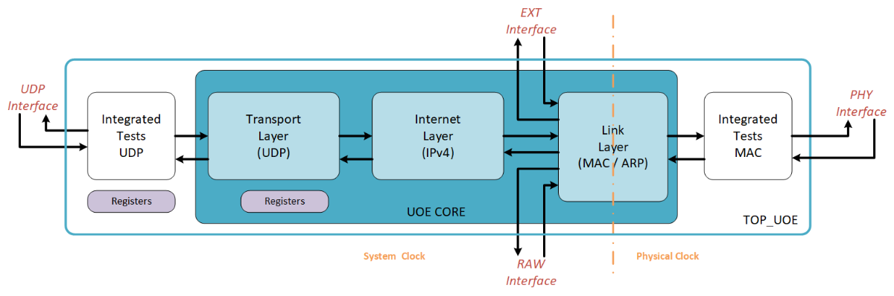

# udp-offload-engine

## Get started

The UDP Offload Engine is an IP VHDL used for FPGA hardware programming.

This IP is an UDP-IP stack accelerator and is able to send and receive data through Ethernet link.
This stack is highly configurable to be used with Ethernet rates up to 40Gb/s thanks to its configurable bus size.
Moreover it is modular. It implements different protocols and integrated testing tools that can be deactivated in order to save resources.

This IP is based on Building Blocks following the Thales Strategy in engineering. They perform basic functions and allow to be independent from the platform/target.
No manufacturer primitive are used on this design, all are inferred.

*******
Tables of contents  
 1. [Documentation](#documentation)
 2. [Key points](#keypoints)
 3. [Performances](#performances)
 4. [Design example](#designexample)
 5. [Vivado IP](#vivado_ip)
 6. [Roadmap](#roadmap)
 7. [Contributing](#contributing)
 8. [License](#license)
 
*******

 

## Documentation

This figure describe the internal architecture of the IP. 
The main entity is the module **_uoe_core_**. 
It was encapsulated in a top wrapper **_top_uoe_** which additionally instantiate some integrated tests functions.

* Functional part

  * Link layer : Lower layer of the IP, it allows the connection with the MAC layer. It handle the Ethernet protocol, directs incoming packets and can filter them.
  * Internet layer : It is the intermediate layer which handle the IPv4 Protocol and a part of ICMP Protocol (Ping)
  * Transport layer : This layer is dedicated to the UDP protocol
  
* Built-In-Test part (Optional)

  * On the main interfaces of the stack (MAC and UDP), two LoopBack fifos have been implemented
  * On the UDP Side, a generator/checker has been integrated for debugging.
  
The Full documentation of the stack is available on the [architecture guide](docs/architecture.md).

 

## Key points

* Configurable bus size

* Handle the following protocols

  * User Datagram Protocol (UDP)
  * Internet Protocol version 4 (IPv4)
    * Fragmentation support
    
* Address Resolution Protocol (ARP)

  * Handle of ARP Table
  * IP/MAC address conflict detection

* Internet Control Message Procotol (ICMP)

  * Echo Request/Reply (PING) (Coming soon...)
  
* Take into account buffers on the MAC interface and clock domain crossing

* Filtering option for incoming traffic

* Use of standard bus

  * Data link in AXI4-Stream 
  * Control link in AXI4-Lite 32 bits
  

 
  
## Performances

The design has been synthesized and implemented with different generics parameters and for several target in out of context. Result are available on the [Performance page](docs/performances.md).
  

## Design example

This repo integrate the following design example :

* AMD-Xilinx FPGA: on KCU105 EvalBoard
  

## Vivado IP package

This repository includes a Tcl script to automatically package the project sources into a Vivado IP. This simplifies its use within Vivado's IP Integrator.
Instructions are available [here](/ip/README.md).

## Roadmap

Coming soon ...

## Contributing

If you are interested in contributing to this project, start by reading the [Contributing guidelines](/CONTRIBUTING.md).

## License

* [Apache License, Version 2.0](LICENSE) 
