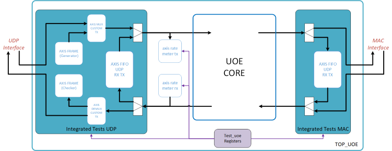

# Introduction

UDP Offload Engine IP aims to handle the layers 2 (MAC ; partially), 3 (IPv4, ARP), 4 (UDP) of an Ethernet interface (See [OSI Model](https://en.wikipedia.org/wiki/OSI_model))

Layer 1 and the other part of layer 2 should be handled outside using an Ethernet Media Access Controller, for example using a manufacturer IP.

This module/IP is in charge to compute in TX and check in RX the Frame Check sequence (32-bit CRC) of the layer 2. Other parts of the layer 2 are handle in our IP.

At the time, the following protocols are handled inside UOE-IP :
* Layer 2 : MAC (Without CRC)
* Layer 3 : IPv4 , ARP
* Layer 4 : UDP
* Layer 7 : DHCP

&nbsp;  
&nbsp;  
&nbsp;  

*******

## Tables of contents  <a name='menu'/> 
 1. [Functional description](#functional_description)
     1. [Interfaces](#interfaces)
     2. [Link layer](#link_layer)
     3. [Internet layer](#internet_layer)
     4. [Transport layer](#transport_layer)
     5. [Application layer](#application_layer)
     6. [Other modules](#other_modules)
 2. [Integrated Tests](#integrated_tests)
 3. [Generic map](#generic_map)
 4. [Ports map](#ports_map)
 5. [Registers map](#register_map)
 6. [User Guide](#user_guide)
 
&nbsp;  
&nbsp;  
&nbsp;  

*******

# Functional description <a name='functional_description'/> 

The following figure represents the functional description of the uoe_core

On all schematics of this documentation, the following caption is applied.

[[Back to menu](#menu)]

&nbsp;  
&nbsp;  
&nbsp;  

*******

## Interfaces <a name='interfaces'/> 

UOE IP Module disposed of the following interface :

* Configuration interface

  * CFG : Configuration Axi4-Lite interface to parameter internal register of the IP
  
    * Size of AWADDR and ARADDR are fixed to 16 bits
  
* Data interface : composed of double bidirectional AXI4-Stream interface for input and output flow. On Axi4-Stream interface TKEEP signal give the validity of each byte of the associated TDATA signal and TLAST informs the end of packet

  * PHY : connected to the physical layer. (Connection with MAC layer)
  
    * UOE-IP is connected to the MAC Layer through a double bidirectional Axi4-Stream interface. 
    * To Handle the different type of interface the size of the bus is configurable using the generic G_MAC_TDATA_WIDTH.
    * In Rx, the TUSER signal associated at the last word of the packet indicate the validity of the entire frame. Its value corresponds to the result of the CRC check ('0' => Invalid packet, '1' => Valid packet).
    * In Tx, the TUSER is not used and always set to '0'. The cancellation of the sending isn't handled on the IP.
    
  * RAW : dedicated to send or received data using RAW Ethernet protocol.
  
    * Size of the signal TDATA is common with the other protocol interface and configured using the generic G_UOE_TDATA_WIDTH
    * TUSER signals are used to indicate the size of the frame to sent. With RAW Protocol, this value correspond directly to the Ethertype field of the MAC Header.
    
  * EXT : Data interface for external processing of packets not handle by the IP (Example TCP => using processor) 
  
    * In Rx, The data circulating on this link are the same as data incoming from Physical interface. No header has been removed. Indeed, some protocol require information from the Ethernet MAC Header.
    * In Tx, complete Ethernet frames should be transmit on this interface 
    
  * UDP : Data interface dedicated to send or received data using IPv4/UDP Ethernet protocol.
  
    * Size of the signal TDATA is given by the generic G_UOE_TDATA_WIDTH
    * TUSER signal is used to transmit or received control information as describe on the following table
    
Mapping of the control word on UDP interface (TUSER signal)

| Bits | Description |
| ---- | ----------- |
| 79..64 | UDP Destination port |
| 63..48 | UDP Source port |
| 47..32 | Size in bytes of the frame transmit / received on the data bus |
| 31..0 | Target IP Address in transmission / Source IP address in reception |      

[[Back to menu](#menu)]

&nbsp;  
&nbsp;  
&nbsp;  
    
*******

## Link layer (Layer 2) <a name='link_layer'/> 

The link_layer module is described on the following figure

This module is composed of 4 sub-modules :
* [Eth frame router](#eth_frame_router)
* [Raw Ethernet](#raw_ethernet)
* [MAC Shaping](#mac_shaping)
* [ARP Module](#arp_module)

[[Back to menu](#menu)]

&nbsp;  
&nbsp;  
&nbsp;  

*******

### Eth frame router <a name='eth_frame_router'/>

This module can itself be broken down into 3 other sub-parts :
- The first one is composed of FIFOs allowing the clock domain crossing between MAC clocks (RX and TX) and "system" clock used on the rest of the UOE.
The configurable depth of the FIFOs also allow a capacity of buffer to store several Ethernet packets.
- The second are only available in RX. It consists in filter the incoming frame. A first stage filters frame when a CRC Error has been returned by the MAC (TUSER = '1').
A second configurable stage is then available to filter packets following there contents (For example, filter broadcast or multicast packets). The configuration can be done through registers.
- The third is in charge of the routing of the different packets following information given by successive headers.

&nbsp;  

**Routing Table**

| Destination | EtherType (Header MAC) | Protocol (Header IPv4) | Destination port (Header UDP/TCP) |
| :--------------: | :--------------: | :--------------: | :--------------: |
| RAW Ethernet | 1 < 1500 (0x05DC) | - | - |
| ARP | 0x0806 (ARP) | - | - |
| Externe | 0x0800 (IPv4) | IGMP | - |
||| ICMPv4 | - |
||| 0x11 (UDP) | 0 to 1023 (Standard port) |
||| 0x06 (TCP) | 0 to 1023 (Standard port) |
|| 0x0806 (ARP) | - | - |
| MAC Shaping | 0x0800 (IPv4) | 0x11 (UDP) | others |
| Trash | 0x0800 (IPv4) | 0x11 (UDP) | 0x89, 0x8A, 0x8B (NBNS) |
||| 0x06 (TCP) | others |
||| others | - |
|| others | - | - |

The trash destination consists in delete the corresponding packet.

There is a subtlety for the ARP packets which were duplicate and transmit to the internal module and also on the External interface. Indeed, with a use of a software stack, ARP packet will be probably required.

[[Back](#link_layer)]

&nbsp;  
&nbsp;  
&nbsp;  

*******

### Raw Ethernet <a name='raw_ethernet'/>

This module is used to handle the RAW Ethernet Protocol. This protocol corresponds to the value between 1 and 1500 of the Ethertype field.
In RX, it removes the MAC Header (14 first bytes). In TX, it inserts the MAC Header at the beginning of the packet (<= 1500 bytes). 
The destination MAC Address should be configured through register access.

[[Back](#link_layer)]

&nbsp;  
&nbsp;  
&nbsp;  

*******

### MAC Shaping <a name='mac_shaping'/>

The aim of this module is to handle the Ethernet Protocol. 

It realize two kind of functions :
- Insert or Remove header (MAC_SHAPING_TX / MAC_SHAPING_RX)
- Store association IP/MAC address. It exists two levels of storage. The first one is the Cache which only memorize the association of the last previous packet sent. 
The second level is the table. It could memorize until 256 associations IP/MAC. The use of the table on the design could be configured with a Generic. 
This function allows to not interrogate the network with ARP at each new packet to send.

In TX, when a new packet is coming in module MAC_SHAPING_TX, the destination IP address is transmit to ARP Cache and ARP Table to define the corresponding MAC address.
If it is not found, the destination IP address is transmitted to the ARP Module to question network (See next paragraph).
If IP is in used on the network, the ARP module will return an association IP/MAC address which are saved in table and cache (for future needs) and used to create an Ethernet header on the incoming packet.

In Rx, the Ethernet Header is removed from the incoming packet with the module MAC_SHAPING_RX.

[[Back](#link_layer)]

&nbsp;  
&nbsp;  
&nbsp;  

*******

### ARP Module <a name='arp_module'/>

The ARP module is composed of 3 main modules :
- ARP RX Protocol catch the incoming ARP and convert to single AXI-Stream transaction to the ARP Controller
- ARP TX Protocol generate ARP frame from transaction given by the ARP Controller
- ARP Controller handle the reception/transmission of ARP request/reply between MAC_SHAPING and protocols.

If a request is received from MAC_SHAPING, the controller transmit the request to the ARP_TX_PROTOCOL which will create an ARP frame. 
When the reply will receive on the RX protocol, the association IP/MAC address will be return to the MAC SHAPING.

If a request is received from RX protocol and UOE is concerned by the request, the controller will transmit a reply through TX protocol.
If a request or reply is received from RX protocol and UOE is not concerned, the controller will just catch the IP/MAC address association and send it to the ARP table to be stored.

After a start up, the module will also transmit N Gratuitous ARP on network (number is configured by Generic), to check if the IP was not already in used on the network.
It is also possible to generate a Gratuitous ARP from register.

[[Back](#link_layer)]

&nbsp;  
&nbsp;  
&nbsp;  

*******

## Internet layer (Layer 3) <a name='internet_layer'/> 

This layer is in charge to handle protocol of layer 3. 
At this time, the only protocol managed by this layer is the IPv4 protocol. 
Other protocol could be added in the future. 

Therefore, the IPv4 module is in charge to insert (in TX) or remove (in RX) an IPv4 header in the incoming packets.

Limitation => The fragmentation is currently not totally handled in RX (dummy byte are not removed correctly).

[[Back to menu](#menu)]

&nbsp;  
&nbsp;  
&nbsp;  

*******
 
## Transport layer (Layer 4) <a name='transport_layer'/> 

This layer is in charge to handle protocol of layer 4. 
At this time, the only protocol managed by this layer is the UDP protocol. 

Therefore, the UDP module is in charge to insert (in TX) or remove (in RX) an UDP header in the incoming packets.

[[Back to menu](#menu)]

&nbsp;  
&nbsp;  
&nbsp;

*******

## Application layer (Layer 7) <a name='application_layer'/> 

This layer is in charge to handle protocol of layer 7. 
At this time, the only protocol managed by this layer is the DHCP protocol. 

The DHCP module handles DHCP messages, ensuring they are correctly formed and processed. 
It works with the UDP module to ensure proper transmission of the DHCP packets.

[[Back to menu](#menu)]

&nbsp;  
&nbsp;  
&nbsp;

*******
 
## Other Modules <a name='other_modules'/> 

### Packet Dropping

On each interface of reception (UDP, RAW, EXT), the IP integrates modules for packet dropping. 
These modules are used to ensure the integrity of incoming packets and no packets can remain blocked in the pipe.

Indeed, the whole IP is constructed with AXI4-Stream buses and flow control are handled on all stages of the IP. 
If a packet dropping module is not used and the external module connected on the link is not real time, a congestion could be propagated inside the IP, and some part of packets could be lost which impact the other interfaces.

These modules could be enabled/disabled with generics (G_ENABLE_PKT_DROP_xxx) and the number of packets dropped could be monitor through registers.

### Registers

The **main_uoe_registers** module handled a AXI4Lite slave interface and is used to configure the functional registers of the IP.

[[Register Map](#register_map)][[Back to menu](#menu)]

&nbsp;  
&nbsp;  
&nbsp;  

*******
 
# Integrated Tests <a name='integrated_tests'/> 

An Ethernet interface could be difficult to integrate on a new board/system, that's why the IP contains integrated tests modules :
- Integrated_tests_mac : 
    - Allows the loopback of the data from MAC TX path to MAC RX path through FIFO.
- Integrated_tests_udp : 
    - Allows the loopback of packets from UDP RX path to UDP TX path through FIFO
    - Disposes of AXIS_FRAME generator and checker to generate pseudo-random packets (size and contents) to test integrity of the link.
- Axis rate meter :
    - Measure the rates on RX and TX link
    
The integrated tests modules could be disabled with generic G_ENABLE_TESTENV and configured through **test_uoe_registers** module.

[[Back to menu](#menu)]

&nbsp;  
&nbsp;  
&nbsp;  

*******

# Generic map <a name='generic_map'/> 

| Name | Type | Value | Description |
| :--------------- | :--------------: | :----------: | :-------------- |
| G_ACTIVE_RST | std_logic | '0' | State at which the reset signal is asserted (Active low or active High) |
| G_ASYNC_RST | boolean | false | Type of reset used (synchronous or asynchronous resets) |
| G_ENABLE_ARP_MODULE | boolean | true | Enable or Disable ARP function |
| G_ENABLE_ARP_TABLE | boolean | true | Enable ARP Table (256 tuples IP/MAC address capability) |
| G_ENABLE_TESTENV | boolean | true | Enable Integrated Test function |
| G_ENABLE_PKT_DROP_EXT | boolean | true | Enable Packet Drop function on EXT RX interface |
| G_ENABLE_PKT_DROP_RAW | boolean | true | Enable Packet Drop function on RAW RX interface |
| G_ENABLE_PKT_DROP_UDP | boolean | true | Enable Packet Drop function on UDP RX interface |
| G_ENABLE_UOE_FREQ_KHZ | integer | 156250 | System frequency use to reference timeout |
| G_MAC_TDATA_WIDTH | integer | 64 | Number of bits used along MAC AXIS itf datapath of MAC interface |
| G_UOE_TDATA_WIDTH | integer | 64 | Number of bits used along AXI datapath of UOE |
| G_ROUTER_FIFO_WIDTH | integer | 1536 | Depth of router fifos (in bytes) |
| G_UOE_FREQ_KHZ | interger | 156250 | System frequency use to reference timeout |

[[Back to menu](#menu)]

&nbsp;  
&nbsp;  
&nbsp;  

*******

# Ports map <a name='ports_map'/>

### Clock and Reset

| Name | Direction | Size | Default value | Value on reset | Description |
| :------ | :-------: | :----: | :-----------: | :------------: | :---------- |
| CLK_UOE | in | 1 | N/A | N/A | System clock |
| RST_UOE | in | 1 | N/A | N/A | System Reset |
| CLK_RX | in | 1 | N/A | N/A | Clock of the MAC interface in reception |
| RST_RX | in | 1 | N/A | N/A | Reset of the MAC interface in reception |
| CLK_TX | in | 1 | N/A | N/A | Clock of the MAC interface in transmission |
| RST_TX | in | 1 | N/A | N/A | Reset of the MAC interface in transmission |

### Physical Layer status

| Name | Direction | Size | Default value | Value on reset | Description |
| :------ | :-------: | :----: | :-----------: | :------------: | :---------- |
| PHY_LAYER_RDY | in | 1 | N/A | N/A | Indicate the readyness of the physical layer |

### Interruption

| Name | Direction | Size | Default value | Value on reset | Description |
| :------ | :-------: | :----: | :-----------: | :------------: | :---------- |
| INTERRUPT | out | 2 | N/A | '0' | Interruption signals of the IP (bit 0 => from the main registers, bit 1 => from the Test registers)|

### MAC interface from/to physical layer

| Name | Direction | Size | Default value | Value on reset | Description |
| :------ | :-------: | :----: | :-----------: | :------------: | :---------- |
| S_MAC_RX_TDATA | in | G_MAC_TDATA_WIDTH | '-' | N/A | TDATA vector of the slave bus |
| S_MAC_RX_TVALID | in | 1 | N/A | N/A | TVALID signal of the slave bus indicate a valid transfer |
| S_MAC_RX_TLAST | in | 1 | '-' | N/A | TLAST signal of the slave bus indicate the last transfer of the packet |
| S_MAC_RX_TKEEP | in | ceil(G_MAC_TDATA_WIDTH/8) | '-' | N/A | TKEEP vector of the slave bus, each bit indicate the validity of the associated byte |
| S_MAC_RX_TUSER | in | 1 | '-' | N/A | TUSER vector of the slave bus use to indicate a valid CRC of the frame |
| M_MAC_TX_TDATA | out | G_MAC_TDATA_WIDTH | N/A | '0' | TDATA vector of the master bus |
| M_MAC_TX_TVALID | out | 1 | N/A | '0' | TVALID signal of the master bus indicate a valid transfer |
| M_MAC_TX_TLAST | out | 1 | N/A | '0' | TLAST signal of the master bus indicate the last transfer of the packet |
| M_MAC_TX_TKEEP | out | ceil(G_MAC_TDATA_WIDTH/8) | N/A | '0' | TKEEP vector of the master bus, each bit indicate the validity of the associated byte |
| M_MAC_TX_TUSER | out | 1 | N/A | '0' | TUSER vector of the master bus (could be used to aborted a transmission). Not implemented at the time => always '0' |
| M_MAC_TX_TREADY | in | 1 | '1' | N/A | TREADY signal of the master bus indicate slave was ready |

### External interface

| Name | Direction | Size | Default value | Value on reset | Description |
| :------ | :-------: | :----: | :-----------: | :------------: | :---------- |
| S_EXT_TX_TDATA | in | G_MAC_TDATA_WIDTH | '-' | N/A | TDATA vector of the slave bus |
| S_EXT_TX_TVALID | in | 1 | N/A | N/A | TVALID signal of the slave bus indicate a valid transfer |
| S_EXT_TX_TLAST | in | 1 | '-' | N/A | TLAST signal of the slave bus indicate the last transfer of the packet |
| S_EXT_TX_TKEEP | in | ceil(G_MAC_TDATA_WIDTH/8) | '-' | N/A | TKEEP vector of the slave bus, each bit indicate the validity of the associated byte |
| S_EXT_TX_TREADY | out | 1 | N/A | '-' | TREADY signal of the master bus indicate slave was ready |
| M_EXT_RX_TDATA | out | G_MAC_TDATA_WIDTH | N/A | '0' | TDATA vector of the master bus |
| M_EXT_RX_TVALID | out | 1 | N/A | '0' | TVALID signal of the master bus indicate a valid transfer |
| M_EXT_RX_TLAST | out | 1 | N/A | '0' | TLAST signal of the master bus indicate the last transfer of the packet |
| M_EXT_RX_TKEEP | out | ceil(G_MAC_TDATA_WIDTH/8) | N/A | '0' | TKEEP vector of the master bus, each bit indicate the validity of the associated byte |
| M_EXT_RX_TREADY | in | 1 | '1' | N/A | TREADY signal of the master bus indicate slave was ready |

### RAW interface

| Name | Direction | Size | Default value | Value on reset | Description |
| :------ | :-------: | :----: | :-----------: | :------------: | :---------- |
| S_RAW_TX_TDATA | in | G_MAC_TDATA_WIDTH | '-' | N/A | TDATA vector of the slave bus |
| S_RAW_TX_TVALID | in | 1 | N/A | N/A | TVALID signal of the slave bus indicate a valid transfer |
| S_RAW_TX_TLAST | in | 1 | '-' | N/A | TLAST signal of the slave bus indicate the last transfer of the packet |
| S_RAW_TX_TKEEP | in | ceil(G_MAC_TDATA_WIDTH/8) | '-' | N/A | TKEEP vector of the slave bus, each bit indicate the validity of the associated byte |
| S_RAW_TX_TUSER | in | 16 | '-' | N/A | TUSER vector of the slave bus indicate the size of the current packet (used only on the first transfer) |
| S_RAW_TX_TREADY | out | 1 | N/A | '-' | TREADY signal of the master bus indicate slave was ready |
| M_RAW_RX_TDATA | out | G_MAC_TDATA_WIDTH | N/A | '0' | TDATA vector of the master bus |
| M_RAW_RX_TVALID | out | 1 | N/A | '0' | TVALID signal of the master bus indicate a valid transfer |
| M_RAW_RX_TLAST | out | 1 | N/A | '0' | TLAST signal of the master bus indicate the last transfer of the packet |
| M_RAW_RX_TKEEP | out | ceil(G_MAC_TDATA_WIDTH/8) | N/A | '0' | TKEEP vector of the master bus, each bit indicate the validity of the associated byte |
| M_RAW_RX_TUSER | out | 16 | N/A | '0' | TUSER vector of the slave bus indicate the size of the current packet |
| M_RAW_RX_TREADY | in | 1 | '1' | N/A | TREADY signal of the master bus indicate slave was ready |

### UDP interface

| Name | Direction | Size | Default value | Value on reset | Description |
| :------ | :-------: | :----: | :-----------: | :------------: | :---------- |
| S_UDP_TX_TDATA | in | G_MAC_TDATA_WIDTH | '-' | N/A | TDATA vector of the slave bus |
| S_UDP_TX_TVALID | in | 1 | N/A | N/A | TVALID signal of the slave bus indicate a valid transfer |
| S_UDP_TX_TLAST | in | 1 | '-' | N/A | TLAST signal of the slave bus indicate the last transfer of the packet |
| S_UDP_TX_TKEEP | in | ceil(G_MAC_TDATA_WIDTH/8) | '-' | N/A | TKEEP vector of the slave bus, each bit indicate the validity of the associated byte |
| S_UDP_TX_TUSER | in | 80 | '-' | N/A | TUSER vector of the slave bus (see description on paragraph [Interfaces](#interfaces)) |
| S_UDP_TX_TREADY | out | 1 | N/A | '-' | TREADY signal of the master bus indicate slave was ready |
| M_UDP_RX_TDATA | out | G_MAC_TDATA_WIDTH | N/A | '0' | TDATA vector of the master bus |
| M_UDP_RX_TVALID | out | 1 | N/A | '0' | TVALID signal of the master bus indicate a valid transfer |
| M_UDP_RX_TLAST | out | 1 | N/A | '0' | TLAST signal of the master bus indicate the last transfer of the packet |
| M_UDP_RX_TKEEP | out | ceil(G_MAC_TDATA_WIDTH/8) | N/A | '0' | TKEEP vector of the master bus, each bit indicate the validity of the associated byte |
| M_UDP_RX_TUSER | out | 80 | N/A | '0' | TUSER vector of the slave bus (see description on paragraph [Interfaces](#interfaces)) |
| M_UDP_RX_TREADY | in | 1 | '1' | N/A | TREADY signal of the master bus indicate slave was ready |

### Control interface (Axi4lite)

| Name | Direction | Size | Default value | Value on reset | Description |
| :------ | :-------: | :----: | :-----------: | :------------: | :---------- |
| S_AXIL_CFG_AWADDR | in | 14 | '-' | N/A | AWADDR field of the write address part of the bus |
| S_AXIL_CFG_AWVALID | in | 1 | '-' | N/A | AWVALID field of the write address part of the bus |
| S_AXIL_CFG_AWREADY | out | 1 | N/A | '0' | AWREADY field of the write address part of the bus |
| S_AXIL_CFG_WDATA | in | 32 | '-' | N/A | WDATA field of the write data part of the bus |
| S_AXIL_CFG_WSTRB | in | 4 | '-' | N/A | WSTRB field of the write data part of the bus |
| S_AXIL_CFG_WVALID | in | 1 | '-' | N/A | WVALID field of the write data part of the bus |
| S_AXIL_CFG_WREADY | out | 1 | N/A | '0' | WREADY field of the write data part of the bus |
| S_AXIL_CFG_BRESP | out | 2 | N/A | '0' | BRESP field of the write response part of the bus |
| S_AXIL_CFG_BVALID | out | 1 | N/A | '0' | BVALID field of the write response part of the bus |
| S_AXIL_CFG_BREADY | in | 1 | '1' | N/A | BREADY field of the write response part of the bus |
| S_AXIL_CFG_ARADDR | in | 14 | '-' | N/A | ARADDR field of the read address part of the bus |
| S_AXIL_CFG_ARVALID | in | 1 | '-' | N/A | ARVALID field of the read address part of the bus |
| S_AXIL_CFG_ARREADY | out | 1 | N/A | '0' | ARREADY field of the read address part of the bus |
| S_AXIL_CFG_RDATA | out | 32 | N/A | '0' | RDATA field of the read data part of the bus |
| S_AXIL_CFG_RRESP | out | 2 | N/A | '0' | RRESP field of the read data part of the bus |
| S_AXIL_CFG_RVALID | out | 1 | N/A | '0' | RVALID field of the read data part of the bus |
| S_AXIL_CFG_RREADY | in | 1 | '1' | N/A | RREADY field of the read data part of the bus |

[[Back to menu](#menu)]

&nbsp;  
&nbsp;  
&nbsp;  

*******

# Registers map <a name='register_map'/>

The register map is available on the file *uoe_registers.xlsm*.

[[Back to menu](#menu)]

&nbsp;  
&nbsp;  
&nbsp;  
*******

# User Guide <a name='user_guide'/>

[[Back to menu](#menu)]
